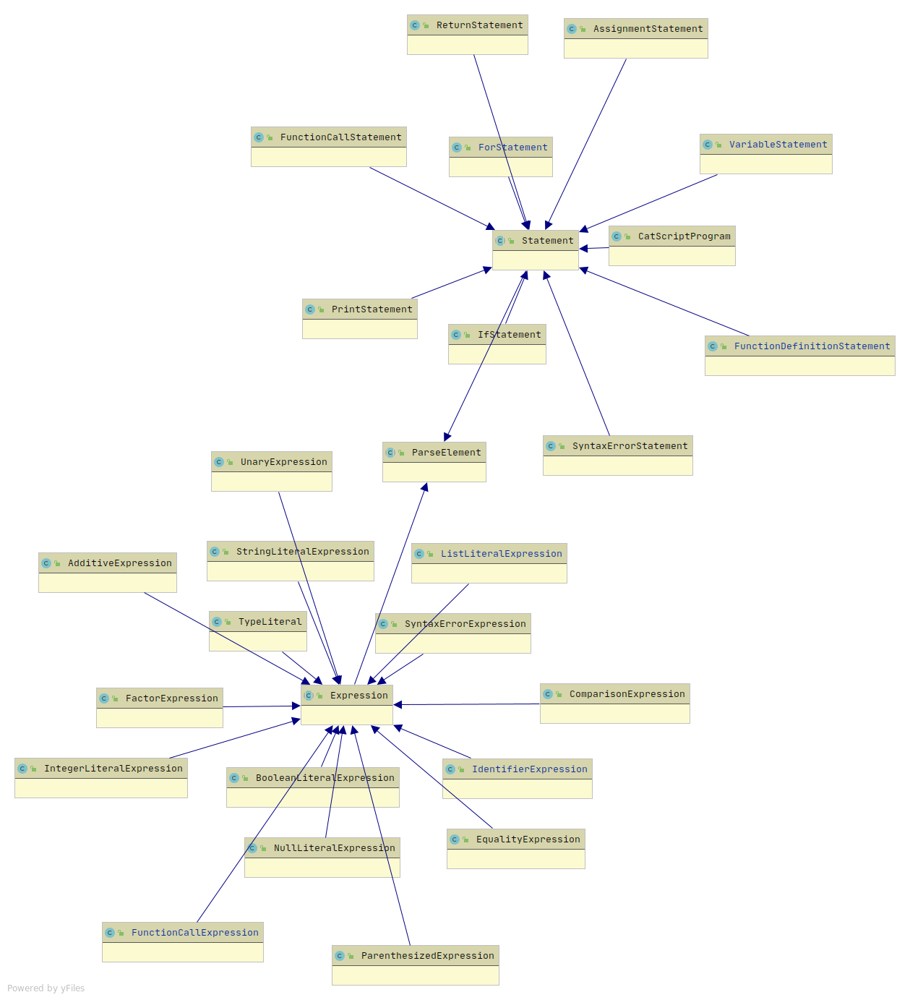

# Program

The source is included in the file source.zip in this directory.

---

# Teamwork

Team member 1 contributed the majority of the code in this project. They designed the components of the compiler and made sure the original tests passed.

Team member 2 contributed documentation for the project, as well as designing a series of additional tests for the compiler to pass. Team member 1 then used these tests to write more or expand on existing code, improving the functionality of the compiler.

---

# Design Pattern

We used the memoization design pattern so that expensive function calls don’t have to be carried out more often than needed. 

The following is code we used for memoization to get a list type in CatscriptType.java:

```javascript
static Map<CatscriptType, CatscriptType> CACHE = new HashMap<>();
public static CatscriptType getListType(CatscriptType type){
	CatscriptType match = CACHE.get(type);
	if (match != null) {
		return match;
	} else {
		ListType listType = new ListType(type);
		CACHE.put(type, listType);
		return listType;
	}
}
```

Memoization is a technique that improves the speed of our language by taking the results of function calls, and holding those results for the next time the function is called. This means that expensive functions don’t have to go through all the computations of a call that was already computed. When a function is called, the language first searches the cache for an identical call, and if one is found, it returns the stored result.

---

# Technical Writing (Documentation)

## Introduction

Catscript is statically typed scripting language that compiles to JVM bytecode. Catscript has several cool features including:

* List literals
* Type inference

The interesting thing is that even though Catscript was created in java, java does not have these two features. Scroll to their respective sections to learn more about list literals and type inference.

### Features

#### Comments

Catscript allows for both block comments `/* <This is a block comment> */` and line comments `// <This is a line comment>` Block comments will exclude anything between `/*` and `*/` from being parsed removing it from compiled code. Line comments will exclude anything after the `//` from being parsed on that specific line.

**Examples:**

```javascrit
function foo() { // This is a line comment so everything here will not be parsed var x print(x)
    var /* This is a block comment so this wont be parsed but the stuff after on this line will */ x = 10
    print(x)
}
foo()
``` 
Output:
```javascipt
10
```

---

#### List Literals

One of the unique features of Catscript is list literals. List literals allow for easy creation of lists. Some programming languages include list literals like Python, but some do not like Java.

**Examples:**

List of ints
```javascript
var lst = [1,2,3]
```

Lists of strings
```javascript
var lst = ["Hello", "There"]
```

#### Type System

Catscipt is a statically typed programming language. This means that the types of all variables and functions/parameters are know at compile time. The Catscript type system is also very simple with only seven types:

* int -Integers
* string -Strings
* bool -Boolean values
* object -Any object
* null -The type of the null value
* void -The type of no type
* list -List of objects

This makes Catscript's learning curve very easy, especially compared to that of Java. The only somewhat complex type is the list. Lists inherit their type from the contents of their list. So `var x = [1, 2, 3]` has the list type of `int` because the values in the list are integers.

One issue with a type system is assignability, determining of type 1 is assignable to type 2. Catscript's assignablity rules are as follows:

* Nothing is assignable from void
* Everything is assignable from null
* Otherwise, check the assignability of the backing java classes I.e int is assignable to string but string is not assignable to int
*  For lists check the type of components of the list

___

### Expressions

Catscript has very basic expressions that include:

* Equality expressions `==` and `!=`
* Comparison expressions `>`, `<`, `>=`, and `<=`
* Additive expressions `+` and `-`
* Factor expressions `*` and `/`
* Unary expressions `not` and `-`
* Primary expressions `IDENTIFIER`, `STRING`, `INTEGER`, `true`, `false`, `null`, `list_literal`, `function_call`, and `( expression )`
* Type expressions `int`, `string`, `bool`, `object`, `list`


### Statements

Catscript includes many basic statements including:

* Assignment
* For
* Function call
* Function definition
* If
* Print statements
* Return
* Variable

---

#### Assignment Statement

Assignment statements allow you to set the value of an `IDENTIFER` to the value of an `EXPRESSION`. Assignment statements are essential to programming otherwise new variables would have to be created every time an expression is to be stored. This would require lots of memory to be allocated to the program, but if you use Catscript you do not have to do that because it includes assignment statements.

**Grammar:**

`assignment_statement = IDENTIFIER, '=', expression`

**Examples:**

```javascript
var x = 20
x = 20 + 1 //Assignment statement
```

```javascript
var x = 20
x = 20 + x //Assignment statement
```

---

#### For Statements

For statements allows for the creation of loops that iterate through a list. For statements start with `for` an `(` followed by an `IDENTIFER`, `in`, a list to iterate through. A `)` to close the iterator followed by statements closed in a set of `{}`.

**Grammar:**

`for_statement = 'for', '(', IDENTIFIER, 'in', expression ')', '{', { statement }, '}'`

**Examples:**

The following code creates a `ListLiteral` named `lst` that has the values 1,2, and 3
```javascript
// List lst
var lst = [1, 2, 3]

// For loop
for( i in lst ) {
    print(i)
}
```

The output for the above code is as follows

```javascript
1 2 3
```

---

#### Function Call Statement

Function call statements allow for the invocation of a function. Function calls are the name of the function to be invoked followed by `()` with the arguments for the function placed inside the parentasis separated by commas. See examples for more clarification.

**Grammar:**

`function_call = IDENTIFIER, '(', argument_list , ')'`

**Examples:**

The following code creates a function foo that has a parameter x of inferred type that prints the value of x.

```javascript
function foo(x) { //Function defintion statement
    print(x)
}

foo("Hello World") //Function call statement
```

The output of the above code

```javascript
Hello World
```

The following creates a function foo that has a parameter x of explicit type string that prints x

```javascript
function foo(x : string) { //Function defintion statement
    print(x)
}

foo("Hello World") //Function call statement
```

The output of the above code

```javascript
Hello World
```

---

#### Function Definition Statement

Function definition statements allow for the creation of methods. They follow the format `function <function_name>(<optional paramaters>) <optionally ':' followed by a return type> { <funtion body statements> }`

**Grammar:**

`function_declaration = 'function', IDENTIFIER, '(', parameter_list, ')' + [ ':' + type_expression ], '{',  { function_body_statement },  '}'`

**Examples:**

The following code creates a function foo that has a parameter x of inferred type that prints the value of x.

```javascript
function foo(x) { //Function defintion statement
    print(x)
}

foo("Hello World") //Function call statement
```

The output of the above code

```javascript
Hello World
```

The following creates a function foo that has a parameter x of explicit type string that prints x

```javascript
function foo(x : string) { //Function defintion statement
    print(x)
}

foo("Hello World") //Function call statement
```

The output of the above code

```javascript
Hello World
```

---

#### If Statements

If statements allow for control flow. This means that certain statements execute based on certain conditions. In Catscript If statements are the only control flow option. They start with an `if` condition and can be chained together with an `else` statement

**Grammar:**

`if_statement = 'if', '(', expression, ')', '{', { statement }, '}' [ 'else', ( if_statement | '{', { statement }, '}' ) ];`

**Examples:**

The following is a simple if statement. If the variable x = 10 it will run the code in the if section.
```javascript
var x = 10
if (x == 10) {
    print("Ten")
}
```

Output:

```javascript
Ten
```

The following is a simple if else statement. If the variable x = 10 it will run the code in the if section, else it will run the code in the else section.
```javascript
var x = 1
if (x == 10) {
    print("Ten")
} else {
    print("Not ten")
}
```

Output:

```javascript
Not ten
```

#### Print Statement

Print statement allows for output to the console

**Grammar:**

`print_statement = 'print', '(', expression, ')'`

**Examples:**

The following example prints `Hello World`

```javascript
print("Hello World")
```

Output:
```javascript
Hello World
```

Print can also be used on expressions. The following prints to console the value returned by `foo()`

```javascript
function foo() {
    return [1,2,3]
}
print(foo())
```

Output:
```javascript
[1, 2, 3]
```

---

#### Return Statement

The return statement allows for the passing of a value from a sub function to its parent.

***Grammar:***

`return_statement = 'return' [, expression];`

***Examples:***

The following prints what is returned from the sub function `foo()` to its parent

```javascript
function foo() {
    return [1,2,3]
}
print(foo())
```

Output:
```javascript
[1, 2, 3]
```

#### Varaible Statements

Variable statements allow for the declaration of variable and the storage of their data. In Catscript there are two types of variables global and local. Global variables are any variable created outside of a function while local variables are any created inside a function.

**Grammar:**

`variable_statement = 'var', IDENTIFIER, [':', type_expression, ] '=', expression;`

**Examples:**

The following is an example of a global variable. This variable can be accessed anywhere in the program.

```javascript
var x = 10 //Global Variable x
function foo() {
    print(x)
}
foo()
```

Output:

```javascript
10
```

The following is a local variable

```javascript
function foo() {
    var x = 10 //Local variable x
    print(x)
}
foo()
print(x) //This line will error out because var x is not defiend in the scope
```

---

# UML

The following is the UML diagram used for our parser:



This hierarchy shows how the Catscript parser parses individual elements when a program is run. First, `ParseElement` is called, at the center of the hierarchy. `ParseElement` then determines if it is parsing an expression or a statement. Once this is determined, it calls either `Expression` or `Statement`, both at the center of many more specific functions.
Both `Expression` and `Statement` determine what type of expression or statement the element is, and then calls the respective parsing function, represented by the many end branches of the UML diagram.

---

# Design Trade-Offs

One of the design trade-offs we made was choosing to use recursive descent for our parser, as opposed to using a parser generator. Recursive descent involves using the language that the rest of the compiler is written in, and writing functions to recursively parse each element of a program, before returning to the top level of the parser. A parser generator simply takes the grammar of your language as input, and then generates code to parse a program in that language.

One of the reasons we made this decision was to avoid learning and using the syntax for a program that would create a parser generator, instead sticking to java, which the rest of the language was created in. This allowed us to be more in-touch with what was going on at every step of parsing, as well as being able to see exactly how a recursive parser can be created using java.

There are some advantages to using a parser generator. It is generally faster to create, and also often parses a program more efficiently. However, it is much more difficult to handle errors in a program, which we were able to do quite easily in our recursive descent parser. Additionally, the code that the generator creates is often more difficult to follow and understand. Because our language is small and simple, we concluded that the cons far outweighed the pros when looking at parser generators.

---

# Software Development Lifecycle Model

We used test-driven development to develop our compiler. Test-driven development uses tests made before development begins, based on the software requirements of the project. Writing the software then involves specifically satisfying these requirements, leading to straightforward code driven predominantly by the original demands of the project. Test-driven development allows requirements to be verified throughout the development process, which allows us to check the safety of changes to the code immediately, and leads to more efficient programming.

We were supplied with a suite of tests for each stage of the project - tokenizing, parsing, evaluation, and bytecode. These tests were used while writing the compiler to track progress and keep the software on the right path. For example in the tokenizing suite, a test would verify that a left parenthesis would correctly return the token `LEFT_PAREN`. Then, in the parsing suite, a test would verify that if a `LEFT_PAREN` token was found, followed by a `RIGHT_PAREN` token, the contents would be parsed as a `ParenthesizedExpression`. In the evaluation suite, a test would then verify that a `ParenthesizedExpression` was evaluated before the other contents of a line. Some statements required multiple tests, for example variable statements had tests to verify they worked both with and without an explicit type cast.

There were pros and cons to using test-driven development. The ability to quickly verify if a new change to the code would work made us able to confidently experiment with different techniques throughout the development process. The tests also served as a direct link between the requirements we had on paper for our project, and the code we were writing to implement these requirements. These two factors led to a very efficient and precise process.

However, each test suite couldn’t always capture every facet of what was required for the compiler to function as a whole. Test-driven development involves writing the minimum code required to pass a test, and then refactoring the code to work better with what you’ve already written. Sometimes, though, it becomes clear in a later stage of development that more is required out of some code, and that none of the tests reflected that. For example, once the parser was written and we moved on to evaluation, it became clear that starts and ends had to be specified for statements in the parser, a problem that was not caught by the parsing tests.
